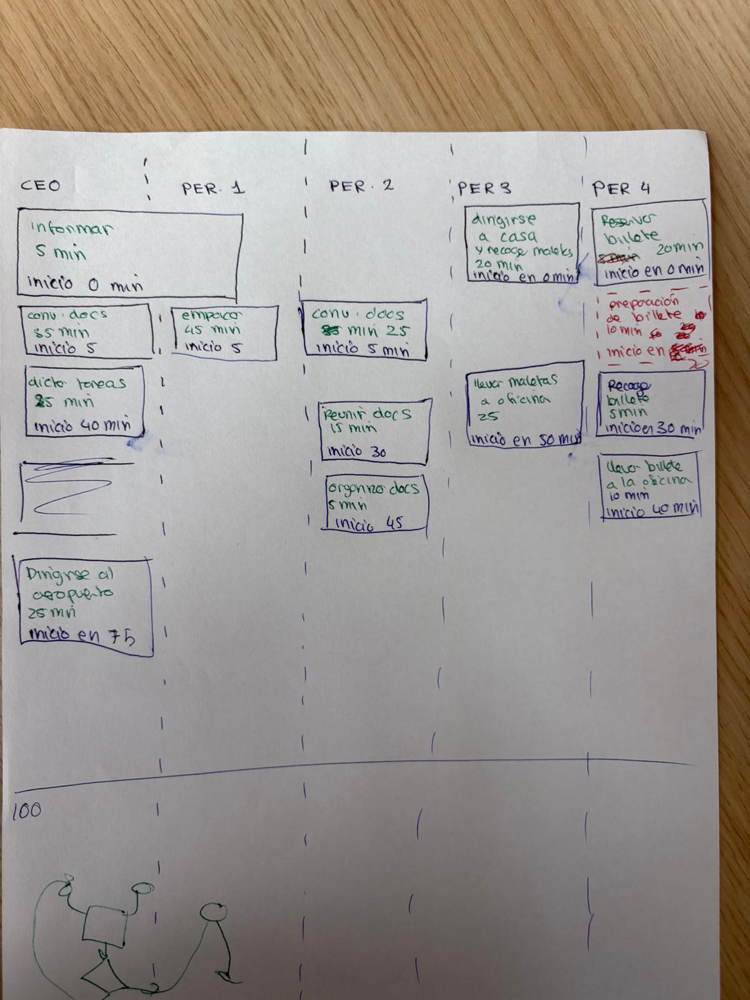

# Examen Parcial 3

[Link del repositorio](https://github.com/pinchiguillo/Examen-Parcial-3)

[Ir a solución](#resolucion)

## Enunciado del Problema

Ustedes son Project Managers en una empresa internacional. Reciben una llamada urgente de un alto ejecutivo, informándoles que el CEO de la compañía ha aterrizado en Barcelona desde Estados Unidos y tiene una reunión crucial para las 19:30 en la ciudad. Sin embargo, el ejecutivo cuenta con solo 100 minutos antes de que cierre la facturación para su vuelo desde Madrid a Barcelona.

**Objetivo**: Debido a la urgencia de la situación, necesitan optimizar las tareas para cumplir con el objetivo de que el ejecutivo llegue a la reunión a tiempo. A continuación se detalla la lista de tareas necesarias, sus descripciones y las duraciones de cada una. Su misión es identificar las dependencias entre las tareas, calcular el tiempo total para completar las tareas en el orden adecuado, y determinar si es posible cumplir con el plazo de 100 minutos.

### Tareas, Descripciones y Duraciones:

- A: Reserva de vuelo (20 min)
- B: Informar a casa para empacar (5 min)
- C: Empacar maletas (40 min)
- D: Preparación del billete por la agencia (10 min)
- E: Recoger el billete de la agencia (5 min)
- F: Llevar el billete a la oficina (10 min)
- G: Recoger las maletas de casa (20 min)
- H: Llevar maletas a la oficina (25 min)
- I: Conversación sobre documentos requeridos (35 min)
- J: Dictar instrucciones para ausencia (25 min)
- K: Reunir documentos (15 min)
- L: Organizar documentos (5 min)
- M: Viajar al aeropuerto y facturar (25 min)
### Dependencias entre tareas:

Algunas tareas deben ser realizadas antes que otras, por ejemplo, no se puede viajar al aeropuerto antes de haber recogido las maletas.
Además, la reserva del vuelo debe completarse antes de recoger el billete, y la preparación del billete debe ocurrir antes de llevar el billete a la oficina.
### Objetivos del Reto:

- Definir el Objetivo del Proyecto: Identificar el propósito principal del proyecto (optimizar la gestión del tiempo para cumplir con el plazo de 100 minutos) y no solo las tareas.

- Diagrama de Flujo del Cronograma: Crear un diagrama de flujo para visualizar el cronograma del proyecto, teniendo en cuenta solo las dependencias entre tareas y no restricciones de recursos.

- Desarrollo de Algoritmo en C++:

- Crear un programa en C++ que:
  - Permita calcular el orden de ejecución de las tareas en función de sus dependencias.
  - Determine el tiempo total necesario para completar todas las tareas.
  - Evalúe si es posible completar las tareas en 100 minutos o menos.
  - Imprima el orden óptimo de ejecución de las tareas y su tiempo total.

### Restricciones:

- El tiempo máximo permitido para completar las tareas es de 100 minutos.
- El algoritmo debe gestionar de forma eficiente las dependencias entre las tareas, de tal manera que optimice el tiempo de ejecución.
### Entrega:

- Código fuente en C++ que implemente la solución al problema.
- Diagrama de flujo que represente el cronograma de ejecución de las tareas.

***¡Buena suerte y que la optimización esté de su lado!***

## Resolucion

### Diagrama de la version original del problema

### Resultados despues de la simulacion

| **Tarea**                              | **Inicio esperado (min)** | **Inicio real (min)** | **Worker Type** | **Worker Name**        | **Fin esperado (min)** | **Fin real (min)** |
|-----------------------------------------|---------------------------|-----------------------|-----------------|------------------------|------------------------|--------------------|
| Informar a casa para empacar            | 0                         | 1                     | CEO             | CEO-Worker             | 5                      | 5                  |
| Reserva de vuelo                        | 0                         | 1                     | GENERIC         | Generic-Worker-1       | 20                     | 20                 |
| Conversación sobre documentos           | 5                         | 6                     | CEO             | CEO-Worker             | 40                     | 40                 |
| Empacar maletas                         | 5                         | 6                     | GENERIC         | Generic-Worker-2       | 45                     | 45                 |
| Preparación del billete por la agencia  | 20                        | 21                    | AGENCY          | Agency-Worker          | 30                     | 30                 |
| Recoger el billete de la agencia        | 30                        | 31                    | GENERIC         | Generic-Worker-1       | 35                     | 35                 |
| Llevar el billete a la oficina          | 35                        | 36                    | GENERIC         | Generic-Worker-1       | 45                     | 45                 |
| Dictar instrucciones para ausencia      | 40                        | 41                    | CEO             | CEO-Worker             | 65                     | 65                 |
| Reunir documentos                       | 30                        | 41                    | GENERIC         | Generic-Worker-3       | 45                     | 55                 |
| Recoger las maletas de casa             | 45                        | 46                    | GENERIC         | Generic-Worker-1       | 65                     | 65                 |
| Organizar documentos                    | 45                        | 56                    | GENERIC         | Generic-Worker-2       | 50                     | 60                 |
| Llevar maletas a la oficina             | 60                        | 66                    | GENERIC         | Generic-Worker-1       | 85                     | 90                 |
| Viajar al aeropuerto y facturar         | 75                        | 91                    | CEO             | CEO-Worker             | 100                    | 115                |

#### Tras comparar los resultados observamos algunas disparidades.
- **Las tareas Comienzan un minuto mas tarde de lo esperado**. Esto se debe a que el primer minuto es el 1. Esto no afecta al resultado final, puesto que en el diagrama original no se tenia en cuenta el primer segundo a la hora de hacer los calculos, pero en la simulacion si.
- **La tarea de Reunir documentos comienza 11 minutos mas tarde de lo esperado**. Esto se debe a que la tarea de Recoger el billete de la agencia se ejecuta antes de lo esperado, y la tarea de Reunir documentos depende de esta. Por lo tanto, la tarea de Reunir documentos se ejecuta 10 minutos despues de lo esperado.

#### Soluciones
- **Para el primer problema**. Se puede solucionar restando 1 a los tiempos de inicio y fin esperados. Pero no es necesario ya que es un fallo de representacion
- **Para el segundo problema**. Se puede solucionar cambiando la dependencia de la tarea de Reunir documentos. En vez de depender de Recoger el billete de la agencia, puede depender de la tarea de Preparacion del billete por la agencia. De esta manera, la tarea de Reunir documentos se ejecutara en el momento esperado.

### Metodos de solucion

#### Clase Task
                              
- Nombre de la tarea: `std::string name;`
- Duración total de la tarea: `int duration;`
- Tiempo restante para completar la tarea: `int remaining_time;`
- Trabajador asignado a esta tarea: `Worker* assigned_worker;`
- Tipo de trabajador requerido para esta tarea: `WorkerType worker_type;`
- Lista de dependencias (otras tareas): `std::vector<std::shared_ptr<Task>> dependencies;`

#### Clase Worker
- Tipo de trabajador (inmutable): `WorkerType type;`
- Tarea actual (puntero inteligente): `std::shared_ptr<Task> currentTask;`
- Indica si el trabajador solo acepta tareas específicas: `bool specific_task;`

#### Simulacion
- Se inicializa un vector con la definicion de las tareas y sus dependencias.
- Se crea un vector de trabajadores y se inicializa con los trabajadores definidos.
- Se siumula minuto a minuto la ejecucion de las tareas.
- Se imprimen los resultados.
